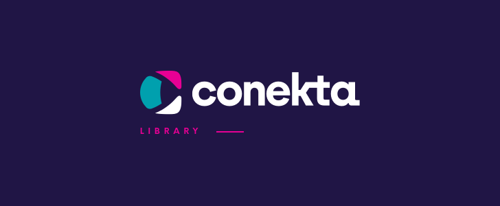

<div align="center">



 # Conekta Ruby


</div>

This is a [Ruby](https://www.ruby-lang.org/) library that allows interaction with [Conekta's API](https://api.conekta.io).

## Requeriments

Add them!

## Installation

Add this line to your application's Gemfile:

    gem 'conekta'

And then execute:

    bundle

Or install it yourself as:

    gem install conekta

## Usage
```ruby
# Set your configuration variables

# This changes the Accept-Language Header to the locale specified
Conekta.locale = :es
Conekta.api_key = '1tv5yJp3xnVZ7eK67m4h'

# Or via an initializer in config/initializers/conekta.rb
Conekta.config do |c|
  c.locale = :es
  c.api_key = '1tv5yJp3xnVZ7eK67m4h'
  c.api_version = '2.0.0'
end

YOUR_DOMAIN = 'localhost:9292'.freeze

# Order creation example
begin
  customer = Conekta::Customer.create(
    {
      name: 'Matz',
      email: 'matz@rules.com'
    }
  )

  order_params =
    {
      currency: 'MXN',
      customer_info: {
        customer_id: customer.id
      },
      line_items: [
        {
          name: 'T-Rex',
          unit_price: 10000,
          quantity: 1
        }
      ],
      checkout: {
        type: 'HostedPayment',
        name: 'Checkout Dummy',
        allowed_payment_methods: %w[cash card bank_transfer],
        success_url: YOUR_DOMAIN + '/success.html',
        failure_url: YOUR_DOMAIN + '/cancel.html',
      }
    }

  order = Conekta::Order.create(order_params)
rescue Conekta::Error => error
  error.details.each do |error_details|
    puts error_detail.message
  end
end
```

## Documentation

Please visit the [official API reference](https://developers.conekta.com/api) for an up-to-date documentation.

Development and Testing
-----------------------
Feel free to play with our library and make pull requests if you find any bugs.
You can run the test suite with [rspec](https://github.com/rspec/rspec-rails) from the library's root directory:

```shell
bundle exec rspec
```

To facilitate the development and testing process you can use one of our Docker containers that come with [RVM](https://github.com/rvm/rvm) and [Ruby](https://www.ruby-lang.org/) versions 1.9.3, 2.1.9, 2.2.4 and 2.3.0:

```shell
docker pull conekta/conekta-ruby

docker run -ti conekta/conekta-ruby /bin/bash --login
```

***

## How to contribute to the project

1. Fork the repository

2. Clone the repository
```
    git clone git@github.com:yourUserName/conekta-ruby.git
```
3. Create a branch
```
    git checkout develop
    git pull origin develop
    # You should choose the name of your branch
    git checkout -b <feature/my_branch>
```
4. Make necessary changes and commit those changes
```
    git add .
    git commit -m "my changes"
```
5. Push changes to GitHub
```
    git push origin <feature/my_branch>
```
6. Submit your changes for review, create a pull request

   To create a pull request, you need to have made your code changes on a separate branch. This branch should be named like this: **feature/my_feature** or **fix/my_fix**.

   Make sure that, if you add new features to our library, be sure that corresponding **unit tests** are added.

   If you go to your repository on GitHub, you’ll see a Compare & pull request button. Click on that button.

***

## We are always hiring!

If you are a comfortable working with a range of backend languages (Java, Python, Ruby, PHP, etc) and frameworks, you have solid foundation in data structures, algorithms and software design with strong analytical and debugging skills, check our open positions: https://www.conekta.com/careers

### License

<div align="center">

Developed in :mexico: Mexico by [Conekta](https://www.conekta.com). Available with [MIT License](LICENSE).

</div>
